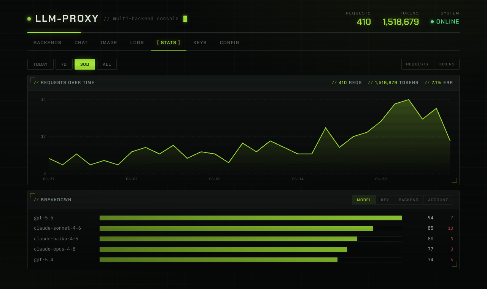
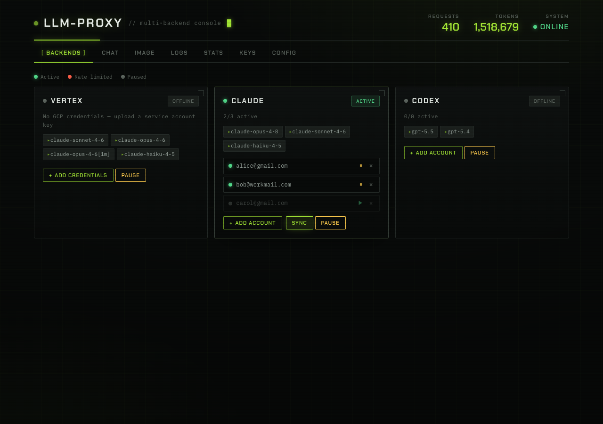

# LLM Proxy

[](https://go.dev)
[](LICENSE)
[](#docker-部署)

**简体中文** | [English](README_EN.md)

为 **Claude Code** 和 **Codex CLI** 设计的轻量 AI API 代理。将 Claude（Vertex AI / OAuth）和 OpenAI Codex（OAuth）统一暴露为兼容 API，支持多账号池、429 自动故障转移、多密钥管理、用量统计和管理仪表板。



## 功能特性

- **多协议兼容** — OpenAI `/v1/chat/completions`、`/v1/responses`、`/v1/images/generations` + Anthropic `/v1/messages` 原生透传
- **开箱即用** — Claude Code、Codex CLI、OpenAI SDK 均可直连，零适配成本
- **多后端路由** — Vertex AI、Claude OAuth、Codex OAuth，按模型名自动分发
- **多账号轮转 + 故障转移** — Round-robin 负载均衡；某账号被上游 429 限流时自动切换到下一个账号，过期 Token 自动跳过
- **多 API Key 管理** — 为不同调用方签发独立密钥，每个密钥可设每日 Token 限额，仪表板增删改
- **可视化统计** — 时间趋势图 + 按模型 / 密钥 / 后端 / 账号的多维度拆分（自适应时区）
- **在线配置** — 仪表板直接编辑各后端模型列表与管理员账号，模型改动即时生效
- **单二进制** — 纯 Go 实现（含 SQLite），无 CGO、无外部依赖，交叉编译即部署
- **Docker 支持** — 一条命令启动

## 快速开始

### Docker 部署

```bash
# 1. 准备配置
cp config.example.yaml config.yaml
# 编辑 config.yaml，设置 token_dir: "/data"

# 2. 启动
docker compose up -d

# 3. 访问仪表板
open http://localhost:9090
```

### 手动编译

```bash
go build -o llm-proxy .
cp config.example.yaml config.yaml
./llm-proxy -config config.yaml
```

## 接入指南

### Claude Code

```bash
export ANTHROPIC_BASE_URL="https://your-domain"
export ANTHROPIC_API_KEY="sk-your-api-key"
claude
```

请求原生透传至 Vertex AI / Claude OAuth，thinking、prompt caching、tool use 等特性完整保留。

### Codex CLI

在 `~/.codex/config.toml` 中添加：

```toml
model_provider = "llm-proxy"
model = "gpt-5.5"

[model_providers.llm-proxy]
name = "LLM Proxy"
base_url = "https://your-domain/v1"
env_key = "LLM_PROXY_API_KEY"
wire_api = "responses"
```

或直接设置环境变量：

```bash
export OPENAI_BASE_URL="https://your-domain/v1"
export OPENAI_API_KEY="sk-your-api-key"
codex
```

### OpenAI SDK

```python
from openai import OpenAI

client = OpenAI(base_url="https://your-domain/v1", api_key="sk-your-api-key")
resp = client.chat.completions.create(
    model="claude-sonnet-4-6",
    messages=[{"role": "user", "content": "你好"}]
)
```

### API 调用

```bash
# 对话
curl https://your-domain/v1/chat/completions \
  -H "Authorization: Bearer sk-your-api-key" \
  -H "Content-Type: application/json" \
  -d '{"model":"claude-sonnet-4-6","messages":[{"role":"user","content":"你好"}],"stream":true}'

# 图片生成
curl https://your-domain/v1/images/generations \
  -H "Authorization: Bearer sk-your-api-key" \
  -H "Content-Type: application/json" \
  -d '{"model":"gpt-image-2","prompt":"一只戴墨镜的猫","size":"1024x1024"}'
```

## 支持的模型

| 后端 | 模型 | 认证方式 |
|------|------|---------|
| Vertex AI | claude-sonnet-4-6, claude-opus-4-6, claude-haiku-4-5 | GCP 凭证（应用默认凭证 / 仪表板上传） |
| Claude OAuth | claude-sonnet-4-6-oauth, claude-opus-4-6-oauth, claude-opus-4-8-oauth | 浏览器 OAuth |
| Codex OAuth | gpt-5.5, gpt-5.4, gpt-5.4-mini, gpt-image-2 | 浏览器 OAuth |

> 模型列表可在仪表板的 **Config** 页在线编辑；Codex 登录后会自动从上游拉取可用模型。

## 鉴权与 API Key

调用方通过 `Authorization: Bearer <key>` 鉴权，支持两种来源：

- **多 API Key（推荐）** — 在仪表板 **Keys** 页为每个调用方签发独立密钥，可单独设置每日 Token 限额、查看用量、随时吊销。
- **单一密钥（可选）** — 在 `config.yaml` 的 `server.api_key` 设置一个全局密钥（留空则不校验，适合内网）。

## 配置说明

```yaml
server:
  port: 9090
  # api_key: "sk-proxy-xxx"            # 可选全局密钥；多数情况用 Keys 页签发更灵活
  admin_user: "admin"                  # 仪表板登录用户名
  admin_password: "password"           # 仪表板登录密码
  cert_file: "/path/to/cert.pem"       # 可选：启用 HTTPS
  key_file: "/path/to/key.pem"

vertex:
  project_id: "your-gcp-project-id"
  region: "us-east5"
  models:
    - name: "claude-sonnet-4-6"        # 客户端请求的模型名
      model: "claude-sonnet-4-6"       # Vertex AI 实际模型名

claude_oauth:
  enabled: true
  token_dir: "/data"                   # Token 和数据库存储路径（默认 ~/.llm-proxy；Docker 场景填 /data）
  models:
    - "claude-sonnet-4-6-oauth"
    - "claude-opus-4-6-oauth"
    - "claude-opus-4-8-oauth"

codex:
  enabled: true
  models:                              # 回退列表；登录后自动从后端拉取
    - "gpt-5.5"
    - "gpt-5.4"
```

## 管理仪表板

访问 `http://your-domain:9090/` 并使用管理员账号登录。

**Backends** — 各后端状态、账号池、配额详情。账号指示灯为运维语义：🟢 可用 / 🔴 被上游限流 / ⚪ 已暂停（OAuth 访问令牌过期会自动续期，不视为告警）。



**Stats** — 时间趋势图（请求数 / Token 可切换，自适应时区），下方按模型 / 密钥 / 后端 / 账号拆分。

其余页签：**Chat**（流式测试对话）、**Image**（图片生成）、**Logs**（请求日志分页）、**Keys**（API 密钥与每日限额）、**Config**（在线编辑模型列表与管理员账号）。

### 账号管理

1. 在 Backends 卡片点击 **+ Add Account**
2. 在浏览器中完成 OAuth 授权
3. Token 自动保存并在启动时自动刷新

请求通过 Round-robin 在多个账号间分配；某账号被上游 429 限流时自动切到下一个，过期 Token 自动跳过。

## 部署

### Docker 部署

```bash
docker compose up -d
```

`docker-compose.yaml` 会将 `config.yaml` 只读挂载到容器内，数据（Token、SQLite）持久化在 Docker Volume 中。

如需使用 Vertex AI，在 `docker-compose.yaml` 中取消注释 GCP 凭证挂载：

```yaml
volumes:
  - ./gcp-credentials.json:/data/gcp-credentials.json:ro
environment:
  - GOOGLE_APPLICATION_CREDENTIALS=/data/gcp-credentials.json
```

### 直接部署

```bash
# 交叉编译
CGO_ENABLED=0 GOOS=linux GOARCH=amd64 go build -o llm-proxy-linux .

# 上传并启动
scp llm-proxy-linux root@server:~/llm-proxy/llm-proxy
scp config.yaml root@server:~/llm-proxy/
nohup ./llm-proxy -config config.yaml > /var/log/llm-proxy.log 2>&1 &
```

## 架构

```
客户端请求
  │
  ├─ /v1/messages           → Router → 原生透传 → Vertex AI / api.anthropic.com
  ├─ /v1/chat/completions   → Router → Executor → 后端 API
  ├─ /v1/responses          → Codex 直通 ────────→ chatgpt.com
  ├─ /v1/images/generations → Codex Tool Call ───→ chatgpt.com
  └─ /v1/models             → 返回所有已注册模型

Executor（执行器）：
  VertexExecutor       → OpenAI ↔ Anthropic Messages API ↔ GCP Vertex AI
  ClaudeOAuthExecutor  → OpenAI ↔ Anthropic Messages API ↔ api.anthropic.com
  CodexExecutor        → OpenAI ↔ Codex Responses API    ↔ chatgpt.com
```

## 技术栈

- **Go** + Gin — Web 框架
- **SQLite** — 纯 Go 实现 (modernc.org/sqlite)，持久化请求日志
- **uTLS** — Chrome TLS 指纹，用于 Claude/Codex 请求
- **Docker** — 多阶段构建，~15MB 镜像

## 许可证

[MIT](LICENSE)
