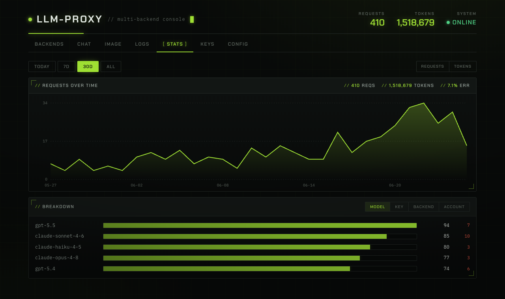
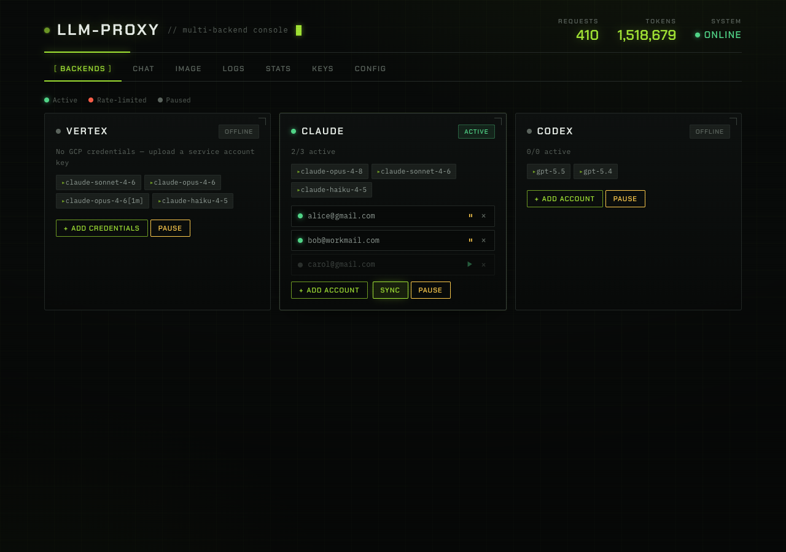

# LLM Proxy

[](https://go.dev)
[](LICENSE)
[](#docker-部署)

**简体中文** | [English](README_EN.md)

为 **Claude Code** 和 **Codex CLI** 设计的轻量 AI API 代理。将 Claude（Vertex AI / OAuth / Anthropic 兼容中转）、OpenAI Codex（OAuth）、Kimi API 和 AnyGen API 统一暴露为兼容 API，支持多账号池、429 自动故障转移、多密钥管理、用量统计和管理仪表板。



## 功能特性

- **多协议兼容** — OpenAI `/v1/chat/completions`、`/v1/responses`、`/v1/images/generations` + Anthropic `/v1/messages` 透传或协议转换
- **开箱即用** — Claude Code、Codex CLI、OpenAI SDK 均可直连，零适配成本
- **多后端路由** — Vertex AI、Claude OAuth、Anthropic 兼容中转、Codex OAuth、Kimi API、AnyGen API，按模型名自动分发
- **多账号轮转 + 故障转移** — Round-robin 负载均衡；某账号被上游 429 限流时自动切换到下一个账号，过期 Token 自动跳过
- **多 API Key 管理** — 为不同调用方签发独立密钥，每个密钥可设每日 Token 限额，仪表板增删改
- **可视化统计** — 时间趋势图 + 按模型 / 密钥 / 后端 / 账号的多维度拆分（自适应时区）
- **花费统计** — 按模型价格表把 token 折算成金额（输入 / 缓存读 / 缓存写 / 输出分别计价），价格可在配置里覆盖
- **在线配置** — 仪表板直接编辑各后端模型列表与管理员账号，模型改动即时生效
- **单二进制** — 纯 Go 实现（含 SQLite），无 CGO、无外部依赖，交叉编译即部署
- **Docker 支持** — 一条命令启动

## 快速开始

### Docker 部署

```bash
# 1. 准备配置
cp config.example.yaml config.yaml
# 编辑 config.yaml，设置 token_dir: "/data"

# 2. 启动
docker compose up -d

# 3. 访问仪表板
open http://localhost:9090
```

### 手动编译

```bash
go build -o llm-proxy .
cp config.example.yaml config.yaml
./llm-proxy -config config.yaml
```

## 接入指南

### Claude Code

```bash
export ANTHROPIC_BASE_URL="https://your-domain"
export ANTHROPIC_API_KEY="sk-your-api-key"
claude
```

请求原生透传至 Vertex AI / Claude OAuth，thinking、prompt caching、tool use 等特性完整保留。

### Codex CLI

在 `~/.codex/config.toml` 中添加：

```toml
model_provider = "llm-proxy"
model = "gpt-5.5"

[model_providers.llm-proxy]
name = "LLM Proxy"
base_url = "https://your-domain/v1"
env_key = "LLM_PROXY_API_KEY"
wire_api = "responses"
```

或直接设置环境变量：

```bash
export OPENAI_BASE_URL="https://your-domain/v1"
export OPENAI_API_KEY="sk-your-api-key"
codex
```

### 通过代理使用 Kimi

Kimi API Key 只从环境变量读取，不会写入 `config.yaml` 或仪表板配置。先撤销任何已泄露的 Key，再设置新 Key：

```bash
export MOONSHOT_API_KEY="新生成的_Kimi_API_Key"
```

在 `config.yaml` 中启用 Kimi：

```yaml
kimi:
  enabled: true
  base_url: "https://api.moonshot.cn/v1"
  api_key_env: "MOONSHOT_API_KEY"
  api_format: "openai"
  models:
    - name: "kimi-k3"       # 客户端使用的模型名
      model: "kimi-k3"      # Kimi 上游实际模型名
```

如果 Key 来自 **Kimi Code 控制台**（Kimi 会员的 Coding Agent 权益），它与开放平台 Key 相互独立，请改用 Anthropic 兼容端点：

```yaml
kimi:
  enabled: true
  base_url: "https://api.kimi.com/coding"
  api_key_env: "MOONSHOT_API_KEY"
  api_format: "anthropic"
  models:
    - name: "kimi-k3"               # 客户端友好别名
      model: "k3"                    # Kimi Coding API 官方模型 ID
    - name: "kimi-for-coding"
      model: "kimi-for-coding"
    - name: "kimi-for-coding-highspeed"
      model: "kimi-for-coding-highspeed"
```

重启代理后，Claude Code 和 Codex CLI 都可以通过代理使用 `kimi-k3`。Kimi Coding API 对未知模型名可能仍返回成功，因此上游 ID 必须使用 `/v1/models` 返回的精确值；K3 的 ID 是 `k3`，不是 `kimi-k3`。

### 接入 Anthropic 兼容中转

中转 token 只从环境变量读取，不会写入配置文件或仪表盘：

```bash
export ANTHROPIC_AUTH_TOKEN="你的中转_token"
```

```yaml
relay:
  enabled: true
  base_url: "http://34.80.212.77/api"
  auth_token_env: "ANTHROPIC_AUTH_TOKEN"
  models:
    - name: "claude-sonnet-4-5-20250929"
    - name: "claude-opus-4-5-20251101"
    - name: "claude-haiku-4-5-20251001"
```

Claude Code 的 `/v1/messages` 请求会原生透传；OpenAI Chat Completions 和 Responses 请求由代理做协议转换。上述三个模型已实际验证可调用，上游 `/v1/models` 中列出的其他模型不代表一定有可用账号。

### 通过代理使用 AnyGen

AnyGen 的 `sk-ag` Key 只从环境变量读取：

```bash
export ANYGEN_LLM_KEY="你的_sk-ag_Key"
```

Key 应精确授权 App 的 `Chat Completions` 和 `Models` 两条 action，并设置 `whole_app=false`。配置 App API base URL：

```yaml
anygen:
  enabled: true
  base_url: "https://www.anygen.io/v1/openapi/anyclaw/app/appg4oo4fl2ay7g2u7my4eaqzy/api/v1"
  api_key_env: "ANYGEN_LLM_KEY"
  models:                         # 仅在启动同步失败时使用
    - "gpt-5.6-luna"
```

启动时代理会调用上游 `GET /models` 动态注册当前可见模型；该查询不触发模型调用、不扣积分。AnyGen Chat Completions 仍只支持非流式请求，`stream:true` 会被明确拒绝；Codex CLI 使用的 `/v1/responses` 会由代理等待完整结果后转换为标准 Responses SSE，支持文本和 function call 事件。积分通过平台原生的 `GET https://www.anygen.io/v1/openapi/key/verify` 查询，不拼在 App 的 `/api/v1` base URL 下，并显示在 Dashboard 的 Quota 页面中。

Claude Code：

```bash
export ANTHROPIC_BASE_URL="https://your-domain"
export ANTHROPIC_AUTH_TOKEN="sk-your-proxy-key"
# 只在 /model 中新增 K3，不覆盖 Opus / Sonnet / Haiku
export ANTHROPIC_CUSTOM_MODEL_OPTION="kimi-k3"
export ANTHROPIC_CUSTOM_MODEL_OPTION_NAME="Kimi K3 via LLM Proxy"
export ANTHROPIC_CUSTOM_MODEL_OPTION_DESCRIPTION="Kimi K3 coding model"
claude
```

上面的环境变量只影响当前终端及其子进程，不会修改 `~/.claude/settings.json`。请勿把
`ANTHROPIC_MODEL`、`ANTHROPIC_DEFAULT_OPUS_MODEL`、
`ANTHROPIC_DEFAULT_SONNET_MODEL` 或 `ANTHROPIC_DEFAULT_HAIKU_MODEL` 设置为
`kimi-k3`，否则 Claude Code 会把默认模型和三个内置模型槽位都显示为 K3。

如果只想临时启动一次 K3，而不把它加入 `/model`：

```bash
ANTHROPIC_BASE_URL="https://your-domain" \
ANTHROPIC_AUTH_TOKEN="sk-your-proxy-key" \
claude --model kimi-k3
```

Codex CLI，在 `~/.codex/config.toml` 中配置：

```toml
model_provider = "llm-proxy"
model = "kimi-k3"

[model_providers.llm-proxy]
name = "Kimi via LLM Proxy"
base_url = "https://your-domain/v1"
env_key = "LLM_PROXY_API_KEY"
wire_api = "responses"
```

```bash
export LLM_PROXY_API_KEY="sk-your-proxy-key"
codex
```

协议链路：Claude Code 的 Anthropic Messages 请求会转换为 Kimi Chat Completions；Codex 的 Responses 请求也会转换为 Chat Completions。文本、流式输出和工具调用已覆盖；Anthropic 专属的 prompt caching、thinking signature、context management 等能力不会完整保留。

### OpenAI SDK

```python
from openai import OpenAI

client = OpenAI(base_url="https://your-domain/v1", api_key="sk-your-api-key")
resp = client.chat.completions.create(
    model="claude-sonnet-4-6",
    messages=[{"role": "user", "content": "你好"}]
)
```

### API 调用

```bash
# 对话
curl https://your-domain/v1/chat/completions \
  -H "Authorization: Bearer sk-your-api-key" \
  -H "Content-Type: application/json" \
  -d '{"model":"claude-sonnet-4-6","messages":[{"role":"user","content":"你好"}],"stream":true}'

# 图片生成
curl https://your-domain/v1/images/generations \
  -H "Authorization: Bearer sk-your-api-key" \
  -H "Content-Type: application/json" \
  -d '{"model":"gpt-image-2","prompt":"一只戴墨镜的猫","size":"1024x1024"}'
```

## 支持的模型

| 后端 | 模型 | 认证方式 |
|------|------|---------|
| Vertex AI | claude-sonnet-4-6, claude-opus-4-6, claude-haiku-4-5 | GCP 凭证（应用默认凭证 / 仪表板上传） |
| Claude OAuth | claude-sonnet-4-6-oauth, claude-opus-4-6-oauth, claude-opus-4-8-oauth | 浏览器 OAuth |
| Codex OAuth | gpt-5.5, gpt-5.4, gpt-5.4-mini, gpt-image-2 | 浏览器 OAuth |
| Kimi Code | kimi-k3（上游 `k3`）, kimi-for-coding, kimi-for-coding-highspeed | `MOONSHOT_API_KEY` 环境变量 |
| AnyGen | 启动时从 `/models` 动态同步（如 gpt-5.6-luna、Gemini、Claude、DeepSeek） | `ANYGEN_LLM_KEY` 环境变量 |

> 模型列表可在仪表板的 **Config** 页在线编辑；Codex 和 AnyGen 会从上游同步可用模型，配置中的 AnyGen 列表仅作为同步失败时的回退。

## 鉴权与 API Key

调用方通过 `Authorization: Bearer <key>` 鉴权：在仪表板 **Keys** 页为每个调用方签发独立密钥，可单独设置每日 Token 限额、查看用量、随时吊销。

> 未签发任何密钥时，`/v1/*` 不做校验（适合内网直连）。

## 配置说明

```yaml
server:
  port: 9090
  admin_user: "admin"                  # 仪表板登录用户名（留空则拒绝所有登录）
  admin_password: "password"           # 仪表板登录密码（同上；可用 LLM_PROXY_ADMIN_USER/PASSWORD 环境变量兜底）
  tray_token: "tray-..."               # 桌面挂件专用只读令牌（/api/tray），留空则挂件无法访问
  cert_file: "/path/to/cert.pem"       # 可选：启用 HTTPS
  key_file: "/path/to/key.pem"

vertex:
  project_id: "your-gcp-project-id"
  region: "us-east5"
  models:
    - name: "claude-sonnet-4-6"        # 客户端请求的模型名
      model: "claude-sonnet-4-6"       # Vertex AI 实际模型名

claude_oauth:
  enabled: true
  token_dir: "/data"                   # Token 和数据库存储路径（默认 ~/.llm-proxy；Docker 场景填 /data）
  models:
    - "claude-sonnet-4-6-oauth"
    - "claude-opus-4-6-oauth"
    - "claude-opus-4-8-oauth"

codex:
  enabled: true
  models:                              # 回退列表；登录后自动从后端拉取
    - "gpt-5.5"
    - "gpt-5.4"

kimi:
  enabled: true
  base_url: "https://api.moonshot.cn/v1"
  api_key_env: "MOONSHOT_API_KEY"       # 这里只写环境变量名，不写 Key
  api_format: "openai"                   # Kimi Code Key 使用 anthropic
  models:
    - name: "kimi-k3"
      model: "kimi-k3"

anygen:
  enabled: true
  base_url: "https://www.anygen.io/v1/openapi/anyclaw/app/appg4oo4fl2ay7g2u7my4eaqzy/api/v1"
  api_key_env: "ANYGEN_LLM_KEY"          # 这里只写环境变量名，不写 sk-ag Key
  models:                                 # 回退列表；启动时免费同步
    - "gpt-5.6-luna"
```

## 管理仪表板

访问 `http://your-domain:9090/` 并使用管理员账号登录。

**Backends** — 各后端状态、账号池、配额详情。账号指示灯为运维语义：🟢 可用 / 🔴 被上游限流 / ⚪ 已暂停（OAuth 访问令牌过期会自动续期，不视为告警）。



**Stats** — 时间趋势图（请求数 / Token / 花费 / 错误数可切换，自适应时区），下方按模型 / 密钥 / 后端 / 账号拆分。

**Config → Models** — 一行一个模型，各后端使用同一形状。名字既是客户端调用的名字、也是发给上游的名字（执行器默认原样透传），只有需要**改名**时才填 `model:`——行内 `↦` 槽位平时是幽灵态，鼠标移过去或已填值时才显形。Vertex / Kimi / Relay 支持改名（Claude OAuth、Codex 和 AnyGen 的执行器不做名字解析）。Models 和 Admin 各自一个保存按钮，互不影响；有未保存改动时按钮会亮起。

**花费统计** — 每条请求在落库时按内置价格表（Anthropic / OpenAI / Moonshot 公开单价）算出金额并冻结，input、cache read、cache write、output 四个桶分别计价。注意这是**按量计费 API 的等价价格**：Claude Code / Codex 订阅账号并不按请求扣费，这个数字表示"同样的 token 走官方 API 要多少钱"。

**改价** — 仪表板 **Config → Models** 每行右侧就是该模型的价格（输入 / 输出，每 100 万 token），点一下展开四个输入框（输入 / 输出 / 缓存读 / 缓存写），保存即写进 `config.yaml` 的 `pricing.models` 并立即生效——补上价格的那一刻，这个模型的历史请求也会一并补算。黄色的 `set price` 表示这个模型没有价格，它的 token 不计入任何花费统计。

也可以直接写配置文件（单位：美元 / 100 万 token）：

```yaml
pricing:
  models:
    - name: "kimi-for-coding"   # 订阅席位，按量成本为 0
      input: 0
      output: 0
    - name: "my-private-model"
      input: 1.5
      output: 6.0
      cache_read: 0.15
      cache_write: 1.875
```

没有任何价格的模型记为**未知**而不是 $0（否则未定价的后端看起来像是免费的），启动日志和 `GET /api/pricing` 会列出这些模型。历史数据在首次启动时按当前价格表补算一次。

别名（Vertex / Kimi 的 `name → model`）会回退到上游模型的价格：叫 `sonnet` 也能按 `claude-sonnet-4-6` 计价——记进数据库的是别名，不回退的话这部分花费就凭空消失了。

其余页签：**Chat**（流式测试对话）、**Image**（图片生成）、**Logs**（请求日志分页）、**Keys**（API 密钥与每日限额）、**Config**（在线编辑模型列表、价格与管理员账号）。

### 账号管理

1. 在 Backends 卡片点击 **+ Add Account**
2. 在浏览器中完成 OAuth 授权
3. Token 自动保存并在启动时自动刷新

请求通过 Round-robin 在多个账号间分配；某账号被上游 429 限流时自动切到下一个，过期 Token 自动跳过。

## 部署

### Docker 部署

```bash
docker compose up -d
```

`docker-compose.yaml` 会将 `config.yaml` 只读挂载到容器内，数据（Token、SQLite）持久化在 Docker Volume 中。

如需使用 Vertex AI，在 `docker-compose.yaml` 中取消注释 GCP 凭证挂载：

```yaml
volumes:
  - ./gcp-credentials.json:/data/gcp-credentials.json:ro
environment:
  - GOOGLE_APPLICATION_CREDENTIALS=/data/gcp-credentials.json
```

### 直接部署

```bash
# 交叉编译
CGO_ENABLED=0 GOOS=linux GOARCH=amd64 go build -o llm-proxy-linux .

# 上传并启动
scp llm-proxy-linux root@server:~/llm-proxy/llm-proxy
scp config.yaml root@server:~/llm-proxy/
nohup ./llm-proxy -config config.yaml > /var/log/llm-proxy.log 2>&1 &
```

## 架构

```
客户端请求
  │
  ├─ /v1/messages           → Router → 透传或转换 → Claude / Vertex / Kimi
  ├─ /v1/chat/completions   → Router → Executor → 后端 API（AnyGen 仅非流式）
  ├─ /v1/responses          → Codex 直通或 Chat→Responses SSE 转换 ──→ chatgpt.com / Kimi / AnyGen
  ├─ /v1/images/generations → Codex Tool Call ───→ chatgpt.com
  └─ /v1/models             → 返回所有已注册模型

Executor（执行器）：
  VertexExecutor       → OpenAI ↔ Anthropic Messages API ↔ GCP Vertex AI
  ClaudeOAuthExecutor  → OpenAI ↔ Anthropic Messages API ↔ api.anthropic.com
  CodexExecutor        → OpenAI ↔ Codex Responses API    ↔ chatgpt.com
  KimiExecutor         → OpenAI/Responses/Anthropic      ↔ Kimi Chat Completions
  AnyGenExecutor       → 非流式 Chat Completions          ↔ AnyGen App API
  ResponsesHandler     → 完整 Chat 结果转标准 Responses SSE
```

## 技术栈

- **Go** + Gin — Web 框架
- **SQLite** — 纯 Go 实现 (modernc.org/sqlite)，持久化请求日志
- **uTLS** — Chrome TLS 指纹，用于 Claude/Codex 请求
- **Docker** — 多阶段构建，~15MB 镜像

## 许可证

[MIT](LICENSE)
